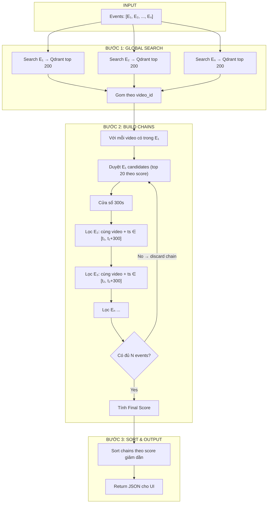

# TRAKE Pipeline — Sequential Windowed Search Diagram



## Key Parameters

| Parameter | Value | Ý nghĩa |
|-----------|-------|---------|
| `top_k` | 200 | Số frame lấy mỗi event |
| `WINDOW_SIZE` | 300s (5 phút) | Cửa sổ thời gian giữa 2 events |
| `λ` (lambda) | 0.5 | Hệ số phạt temporal |
| Max E₁ candidates | 20 | Số E₁ frame thử mỗi video |

## Scoring

```
Final_Score = (1/N × Σ Sim(Qᵢ, Fᵢ)) × exp(-0.5 × (tₙ - t₁) / 300)
```

- **Sim(Qᵢ, Fᵢ)** = vector similarity (Qdrant score) giữa event text và frame
- **exp(-0.5 × duration / 300)** = temporal penalty factor
- Events xảy ra càng sát nhau → factor càng gần 1 → score càng cao

## So sánh OLD vs NEW

| | OLD (Independent + Intersection) | NEW (Sequential Windowed) |
|---|---|---|
| Filter | Hard: video phải có trong ALL events | Soft: mỗi bước lọc theo window |
| Temporal | Boolean (OK / not OK) × 2.0 | Continuous penalty exp(-λ×d/W) |
| Scoring | Σ e^(-0.02×rank) | Mean_similarity × temporal_factor |
| Retriever | Build N lần (1/event) | Build 1 lần, reuse |

## Lưu ý

- **3 events → 3 lần search Qdrant × 200 = 600 frames** (không search lại trong vòng lặp)
- **Không có intersection cứng** — video chỉ cần có E₁ trong top 200 là được xét
- **Nếu E₂ không có frame nào trong window 300s → discard chain đó**
- **Không trùng frame_id giữa các events trong cùng chain** — mỗi candidate bị loại nếu `frame_id` đã có trong chain trước đó.
- **Timestamp strict** (`<` thay vì `<=`) — Eᵢ₊₁ phải có timestamp **lớn hơn hẳn** Eᵢ, không được bằng.
