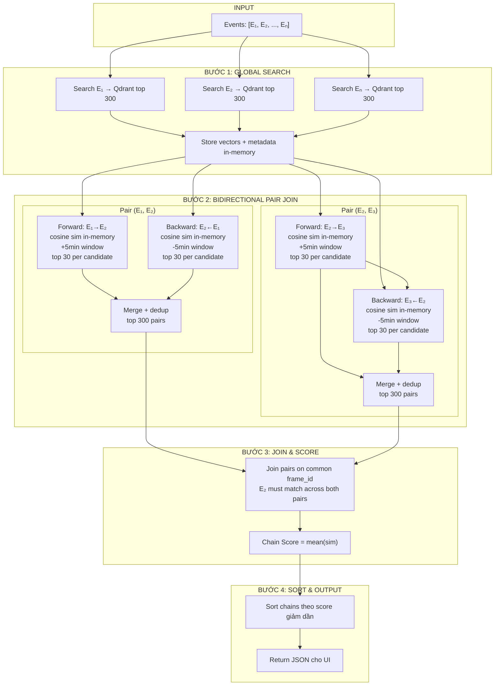

# TRAKE Pipeline — Bidirectional Pair Join (BPJ) Diagram



## Key Parameters

| Parameter | Value | Ý nghĩa |
|-----------|-------|---------|
| `top_k` | 300 | Số frame lấy mỗi event từ Qdrant |
| `WINDOW_SIZE` | 300s (5 phút) | Cửa sổ thời gian cho pair matching |
| Window search top-K | 30 | Số best match giữ lại mỗi candidate |
| Max pairs per adjacent pair | 300 | Số cặp giữ lại sau merge mỗi cặp |

## Scoring

### Pair Score (cho mỗi cặp frame trong forward/backward)

```
Pair_Score = Sim(fᵢ, eᵢ) + Sim(fᵢ₊₁, eᵢ₊₁)
```

- **Sim(fᵢ, eᵢ)** = vector similarity (Qdrant score) giữa event text eᵢ và frame fᵢ
- Không temporal penalty — score thuần semantic

### Chain Score (cho chain hoàn chỉnh)

```
Chain_Score = mean(Sim(f₁, e₁), Sim(f₂, e₂), ..., Sim(fₙ, eₙ))
```

- **mean(sim)** = trung bình similarity scores của tất cả frame
- Không temporal penalty — chỉ dựa trên độ khớp semantic

## So sánh OLD vs BPJ

| | OLD (Sequential Windowed) | NEW (Bidirectional Pair Join) |
|---|---|---|
| Strategy | Greedy-forward từ E₁ | Bidirectional, mỗi cặp độc lập |
| E₂ matching | Qdrant score (global) | In-memory cosine similarity với query E₂ |
| Search chiều | 1 chiều (forward) | 2 chiều (forward + backward) |
| Dedup | Tránh trùng frame_id trong chain | Dedup pairs theo (frame_idᵢ, frame_idᵢ₊₁) |
| Temporal penalty | Có (tuyến tính) | Không |
| Nhạy cảm với E₁ bad frame | Rất — nếu E₁ sai, chain hỏng | Ít — backward pass có thể cứu |

## Lưu ý

- **N events → N lần search Qdrant × 300 frames**
- **Forward + Backward cho mỗi adjacent pair → 2(N-1) passes in-memory**
- **In-memory cosine similarity** dùng preloaded frame embeddings và query vector — không search lại Qdrant
- **Window search top-30** mỗi candidate → ≤9000 pairs mỗi chiều → merge → top 300
- **Join pairs** bằng cách matching frame_id của event ở giữa
- **Không temporal penalty** — score chỉ dựa trên độ khớp semantic thuần
